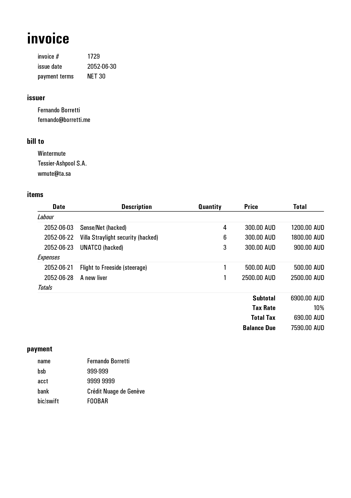

# mkinvoice

[](https://github.com/eudoxia0/mkinvoice/actions/workflows/test.yaml)

Script to create beautiful PDF invoices for my consulting practice.

Requires [Chromium][chrom]: invoices are rendered to HTML and then to PDF using
headless Chromium's print-to-PDF function.

[chrom]: https://en.wikipedia.org/wiki/Chromium_(web_browser)

## Usage

```
$ mkinvoice invoice.toml invoice.pdf
```

## Example

Here is an example invoice:

```toml
[issuer]
name  = "Fernando Borretti"
email = "fernando@borretti.me"

[recipient]
name    = "Wintermute"
company = "Tessier-Ashpool S.A."
email   = "wmute@ta.sa"

[[labour]]
date        = "2052-06-03"
description = "Sense/Net (hacked)"
unit_price  = 300.0
quantity    = 4

[[labour]]
date        = "2052-06-22"
description = "Villa Straylight security (hacked)"
unit_price  = 300.0
quantity    = 6

[[labour]]
date        = "2052-06-23"
description = "UNATCO (hacked)"
unit_price  = 300.0
quantity    = 3

[[expenses]]
date        = "2052-06-21"
description = "Flight to Freeside (steerage)"
unit_price  = 500.0
quantity    = 1

[[expenses]]
date        = "2052-06-28"
description = "A new liver"
unit_price  = 2500.0
quantity    = 1

[payment]
name  = "Fernando Borretti"
bsb   = "999-999"
acct  = "9999 9999"
bank  = "Crédit Nuage de Genève"
swift = "FOOBAR"
```

And this is what `mkinvoice` renders:



## License

© 2026 by [Fernando Borretti][fb]. Released under the [Apache 2.0][apache2] license.

[fb]: https://borretti.me/
[apache2]: https://www.apache.org/licenses/LICENSE-2.0
